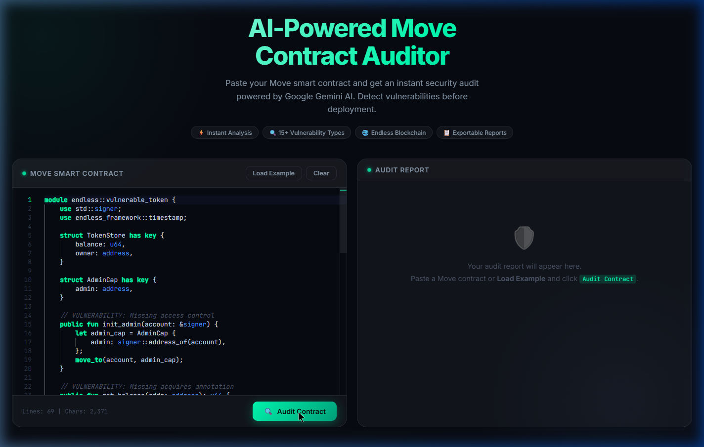

# 🔒 Endless Auditor

> **AI-Powered Smart Contract Security Auditor for Move Language**  
> Automatically detect vulnerabilities in your Move smart contracts using OpenRouter AI — instantly, via Web UI or CLI.



---

## ✨ Features

- 🤖 **AI-Powered** — Uses OpenRouter (Gemini, GPT-4, Claude, etc.) for deep semantic analysis
- 🔍 **15+ Vulnerability Categories** — Covers all major Move-specific attack vectors
- 🌐 **Web UI** — Beautiful dark-mode editor with Monaco (VS Code engine)
- 💻 **CLI Tool** — Audit contracts directly from your terminal
- 📋 **Structured Reports** — Severity badges, line references, remediation advice
- 📊 **Risk Score** — Animated 0–100 risk gauge per contract
- 💾 **Export** — Download reports as Markdown or JSON
- ⚡ **Move Syntax Highlighting** — Custom Monaco grammar for `.move` files

---

## 🛡️ Vulnerability Categories Detected

| # | Category | Description |
|---|---|---|
| 1 | **Integer Overflow/Underflow** | Arithmetic wrap-around without bounds checking |
| 2 | **Reentrancy** | Resource manipulation enabling re-entrant calls |
| 3 | **Missing `acquires` Annotation** | Borrowing globals without proper annotation |
| 4 | **Access Control** | Missing `signer` checks, unauthorized function access |
| 5 | **Resource Leaks** | Resources created but never stored or destroyed |
| 6 | **Double-free / Double-borrow** | Resources used after move or destroyed twice |
| 7 | **Unchecked Return Values** | Ignored `Option<T>` or error codes |
| 8 | **Logic Errors** | Off-by-one, incorrect business logic |
| 9 | **Timestamp Randomness** | Using `timestamp::now_*` as a randomness source |
| 10 | **Visibility Issues** | Functions that should be `private` exposed as `public` |
| 11 | **Missing Event Emissions** | State changes not emitting Move events |
| 12 | **Infinite Loops** | Loop conditions that may never terminate |
| 13 | **Type Confusion** | Incorrect type assumptions or unsafe casts |
| 14 | **Flash Loan Vulnerabilities** | Economic attacks via flash loans |
| 15 | **Front-Running** | Transaction ordering vulnerabilities |

---

## 📁 Project Structure

```
Endless Smart Contract Auditor/
├── server.js               ← Express backend + OpenRouter AI integration
├── .env                    ← API key and model configuration
├── package.json
│
├── prompts/
│   └── audit-prompt.js     ← AI system prompt (Move-specific vulnerability rules)
│
├── public/                 ← Web UI (served by Express)
│   ├── index.html          ← Main page with Monaco editor
│   ├── style.css           ← Dark glassmorphism design system
│   └── app.js              ← Frontend logic + report renderer
│
├── cli/
│   └── audit.js            ← CLI tool (standalone, no server needed)
│
└── samples/
    └── example.move        ← Intentionally vulnerable demo contract
```

---

## 🚀 Quick Start

### Prerequisites

- [Node.js](https://nodejs.org/) v18+
- An [OpenRouter](https://openrouter.ai/) API key

### 1. Clone / Setup

```bash
cd "Endless Smart Contract Auditor"
npm install
```

### 2. Configure Environment

Edit `.env`:

```env
OPENROUTER_API_KEY=sk-or-v1-your-key-here
OPENROUTER_MODEL=google/gemini-2.0-flash-001
PORT=3000
```

### 3. Choose Your Interface

#### 🌐 Web UI
```bash
npm start
# Open http://localhost:3000
```

#### 💻 CLI
```bash
# Audit a file
node cli/audit.js samples/example.move

# Audit and save report
node cli/audit.js samples/example.move --output report.json

# Use a different model
node cli/audit.js mycontract.move --model anthropic/claude-3-haiku

# Markdown output
node cli/audit.js mycontract.move --format markdown
```

---

## 🌐 Web UI Guide

1. Open **http://localhost:3000**
2. Paste your Move contract into the left editor panel  
   *(or click **Load Example** to try the demo vulnerable contract)*
3. Click **Audit Contract**
4. Review findings on the right panel:
   - Each finding shows **severity**, **category**, **description**, **code location**, **impact**, and **remediation**
   - Click a finding card to expand/collapse details
5. Export your report via **Export Markdown** / **Export JSON** / **Copy Report**

---

## 💻 CLI Guide

```bash
node cli/audit.js <contract-file> [options]
```

### Options

| Flag | Description | Default |
|---|---|---|
| `--output <file>` | Save report to file (`.json` or `.md`) | Print to stdout |
| `--format <type>` | Output format: `json` or `markdown` | `markdown` |
| `--model <model>` | OpenRouter model to use | From `.env` |
| `--help` | Show help | — |

### Example Output (CLI)

```
🔒 Endless Auditor — CLI
━━━━━━━━━━━━━━━━━━━━━━━━━━━━━━━━━━━━━━━━━━━━━━━━
📄 Contract : samples/example.move
🤖 Model    : google/gemini-2.0-flash-001
━━━━━━━━━━━━━━━━━━━━━━━━━━━━━━━━━━━━━━━━━━━━━━━━

🔍 Analyzing... this may take 10-30 seconds

━━━━━━━━━━━━━━━━━━━━━━━━━━━━━━━━━━━━━━━━━━━━━━━━
📊 AUDIT REPORT — endless::vulnerable_token
━━━━━━━━━━━━━━━━━━━━━━━━━━━━━━━━━━━━━━━━━━━━━━━━
Risk Score : 78 / 100  [HIGH]
Findings   : 6
━━━━━━━━━━━━━━━━━━━━━━━━━━━━━━━━━━━━━━━━━━━━━━━━

🔴 [CRITICAL] FIND-001 — Missing Access Control on init_admin
   Category    : Access Control
   Line        : ~17
   Description : The init_admin function can be called by anyone...
   Impact      : Any account can claim admin privileges
   Fix         : Add assert!(signer::address_of(account) == @admin_addr, E_NOT_AUTHORIZED)

🟠 [HIGH] FIND-002 — Integer Overflow in add_balance
   ...

━━━━━━━━━━━━━━━━━━━━━━━━━━━━━━━━━━━━━━━━━━━━━━━━
✅ Positives
  ✓ Uses signer-based ownership pattern in TokenStore
━━━━━━━━━━━━━━━━━━━━━━━━━━━━━━━━━━━━━━━━━━━━━━━━
```

---

## 🤖 Supported OpenRouter Models

You can change the model in `.env` or via `--model` CLI flag:

| Model ID | Notes |
|---|---|
| `google/gemini-2.0-flash-001` | ⭐ Default — fast, great for code |
| `google/gemini-2.0-pro-exp-02-05:free` | Higher reasoning, slower |
| `anthropic/claude-3-5-haiku` | Excellent code analysis |
| `anthropic/claude-3-7-sonnet` | Best quality, higher cost |
| `openai/gpt-4o-mini` | Cost-effective |
| `openai/gpt-4o` | Premium quality |
| `deepseek/deepseek-r1` | Strong reasoning model |
| `meta-llama/llama-3.3-70b-instruct` | Open source option |

Browse all models at [openrouter.ai/models](https://openrouter.ai/models).

---

## 🔧 API Reference

### `POST /api/audit`

Audit a Move smart contract.

**Request:**
```json
{
  "code": "module example::mycontract { ... }"
}
```

**Response:**
```json
{
  "contractName": "example::mycontract",
  "summary": "This contract implements...",
  "riskScore": 72,
  "riskLevel": "HIGH",
  "totalFindings": 4,
  "findings": [
    {
      "id": "FIND-001",
      "title": "Missing Signer Verification",
      "severity": "CRITICAL",
      "category": "Access Control",
      "description": "...",
      "location": { "line": 23, "code": "public fun transfer(from: address, ..." },
      "impact": "...",
      "recommendation": "..."
    }
  ],
  "gasAnalysis": { "complexity": "MEDIUM", "notes": "..." },
  "positives": ["Uses capability pattern correctly"],
  "auditedAt": "2026-03-24T09:00:00.000Z",
  "lineCount": 69,
  "codeLength": 2371,
  "model": "google/gemini-2.0-flash-001",
  "disclaimer": "..."
}
```

### `GET /api/health`

```json
{ "status": "ok", "version": "1.0.0", "model": "google/gemini-2.0-flash-001" }
```

---

## 🔒 Security & Privacy

- Contract code is sent to OpenRouter's API for analysis — **do not audit private/unreleased contracts**
- API keys are stored locally in `.env` — never commit `.env` to version control
- Add `.env` to your `.gitignore`

---

## ⚠️ Disclaimer

Endless Auditor is an AI-assisted tool and **does not replace a professional security audit**. AI models can miss vulnerabilities or produce false positives. Always validate findings with a qualified Move security engineer before deploying to mainnet.

---

## 📄 License

MIT — built for the [Endless Blockchain](https://endless.link) developer ecosystem.
